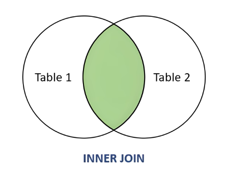

## My SQL joins
In SQL, ***JOINs*** are used to combine rows from two or more tables based on related
columns — usually a foreign key in one table referencing a primary key in another.

We will use two tables here:

#### user table
<table>
<tr>
<th>id</th>
<th>name</th>
</tr>

<tr>
<td>1</td>
<td>Aarav</td>
</tr>

<tr>
<td>2</td>
<td>Sneha</td>
</tr>

<tr>
<td>3</td>
<td>Raj</td>
</tr>
</table>

#### address table
<table>
<tr>
<th>id</th>
<th>user_id</th>
<th>city</th>
</tr>

<tr>
<td>1</td>
<td>1</td>
<td>Mumbai</td>
</tr>

<tr>
<td>2</td>
<td>2</td>
<td>Kolkata</td>
</tr>

<tr>
<td>3</td>
<td>4</td>
<td>Delhi</td>
</tr>
</table>

Note: `user_id` is a ***foreign key*** that references `user.id`

1. INNER JOIN

Returns **only** the matching rows from the tables.
```sql
SELECT users.name, addresses.city
FROM users
INNER JOIN addresses ON users.id = addresses.user_id;
```
**Output**
<table>
<tr>
<th>name</th>
<th>city</th>
</tr>

<tr>
<td>Aarav</td>
<td>Mumbai</td>
</tr>

<tr>
<td>Sneha</td>
<td>Kolkata</td>
</tr>
</table>

`Raj` is excluded because there is no matching address. `Delhi` is excluded because its `user_id (4)` is not in `users`.

**Visual representation**
```css
users addresses
----- ------
| 1 | | 1 |
| 2 | | 2 |
|   | |   |
=> only matching pairs
```



2. LEFT JOIN

Returns all rows from the left table ( users ), and matching rows from the right
table ( addresses ). If no match is found, NULLs are returned.
```sql
SELECT users.name, addresses.city
FROM users
LEFT JOIN addresses ON users.id = addresses.user_id;
```
**Output**
<table>
<tr>
<th>name</th>
<th>city</th>
</tr>

<tr>
<td>Aarav</td>
<td>Mumbai</td>
</tr>

<tr>
<td>Sneha</td>
<td>Kolkata</td>
</tr>

<tr>
<td>Raj</td>
<td>NULL</td>
</tr>
</table>

`Raj` is shown even though he doesn't have an address

**Visual representation**
```css
users addresses
----- ------
| 1 | | 1 |
| 2 | | 2 |
| 3 | |   |
=> all users + matched addresses (or NULL)
```


3. RIGHT JOIN

Returns **all rows from the right table** ( addresses ), and matching rows from the
left table ( users ). If no match is found, NULLs are returned.
```sql
SELECT users.name, addresses.city
FROM users
RIGHT JOIN addresses ON users.id = addresses.user_id;
```
**Output**
<table>
<tr>
<th>name</th>
<th>city</th>
</tr>

<tr>
<td>Aarav</td>
<td>Mumbai</td>
</tr>

<tr>
<td>Sneha</td>
<td>Kolkata</td>
</tr>

<tr>
<td>NULL</td>
<td>Delhi</td>
</tr>
</table>

`Delhi` is shown even though it points to a `user_id` that doesn't exist.

**Visual representation**
```css
users addresses
----- ------
| 1 | | 1 |
| 2 | | 2 |
|   | | 4 |
=> all addresses + matched users (or NULL)
```

